.. _code-generation-editors:

######################
SCXML editors
######################

.. contents::
   :local:

Unfortunately, there doesn't seem to be too many available free SCXML editors, and even less of
them are actively maintained. I tried to gather on this page all usable tools that I was able to find.

Qt Creator
================

Qt Creator is the easiest one to start with. Though personally, I feel like
arranging transitions is a bit sloppy. I hope they will add "snap-to-grid" feature in future releases.

Can be downloaded from:

- `GitHub repository <https://github.com/qt-creator/qt-creator>`__
- `Qt binary portal <https://download.qt.io/>`__
- installed together with `Qt SDK <https://www.qt.io/download>`__

.. warning:: Ubuntu version of Qt Creator crashes quite often when working with state machines. It's highly recommended to save often to avoid frustration.

.. warning:: using *parallel* element in version 4.14.2 on Ubuntu **crashes editor when saving file**. This happens after editing state machine for awhile and doesn't seem to occur if only a couple of modifications were made. Hopefully will get fixed.

|Editing HSM in Qt Creator|

Basics of how to define a state machine in Qt Creator can be checked
here:

-  `Editing State Charts in Qt Creator <https://doc.qt.io/qtcreator/creator-scxml.html>`__
-  `Qt SCXML and state machine tooling in Qt Creator <https://www.youtube.com/watch?v=9xqhq9nDiOg>`__

Now let's go through working with hsmcpp specific features.

Specifying callbacks in editor
------------------------------

There are 4 types of callbacks (see :ref:`features-states-actions` and
:ref:`features-transitions` for details):

-  state entering
-  state changed
-  state exiting
-  transition

They are specified as a C++ callback name which will be generated in HSM
class.

State changed callback can be specified in **state->Invoke->srcexp** or **state->Invoke->src**:
|State callback|

State entering callback can be specified in **state->onentry->script->Content**:
|State entering callback|

State exiting callback can be specified in **state->onexit->script->Content**:
|State exiting callback|

Transition callback can be specified in **transition->script->Content**:
|State exiting callback|

Working with timers and actions
-------------------------------

:ref:`features-states-actions` in HSM provide following operations:

-  start timer
-  stop timer
-  restart timer
-  trigger transition on timer
-  trigger a regular transition

Actions can be specified in:

-  state->onentry
-  state->onexit

|Timer start action|

Command format is:

-  *start_timer(<timer_id>, < interval in milliseconds >, <is
   singleshot: true \| false>)*
-  *stop_timer(<timer_id>)*
-  *restart_timer(<timer_id>)*
-  *transition(<event_id>, {arg1, arg2, ...})*

   -  .. note:: arguments are optional. at the moment only strings and numbers are supported

Using any of the above timer actions will result in availability of
timer event. Name format: **ON_TIMER_<timer_id>** |Timer transition|

Conditional transitions
-----------------------

Condition for transitions can be specified in **transition->cond**:
|Conditional transition|

Possible formats:

-  *<callback_name> is false*
-  *<callback_name> is true*
-  *<callback_name>* (same as "is true")

Conditional entry points
------------------------

Hsmcpp library supports :ref:`features-substates-conditional_entry_points`, but defining them
through editor directly is not possible.

First, create your substates, define an entry point and add a single
transition. |Multiple entries|

Now you need to save the file and open SCXML file in some text editor
(Qt Creator doesn't allow editing SCXML files directly). Find your
section. |Original XML|

Modify it to look like this (ignore **<qt:editorinfo>** tag). Add as many transitions as you need. |Modified XML|

After reloading SCXML file in Qt Creator your HSM should look like this.
|Conditional entry points|

scxmlgui
========

Website: `<https://github.com/fmorbini/scxmlgui>`__

Simple editor written in Java. Requires a bit more manual work than Qt Creator, but does the job.
Binary can be downloaded from `GitHub repository <https://github.com/fmorbini/scxmlgui/blob/master/extra/fsm-editor.jar>`__.

|Editing HSM in scxmlgui|

YAKINDU Statechart Tools
========================

Website: `YAKINDU Statechart Tools <https://www.itemis.com/en/yakindu/state-machine/documentation/user-guide/inst_installing_yakindu_statechart_tools>`__

This tool comes with a lot of extra features, but what's important is that it has a state machine editor and a way to `export it in
SCXML format <https://www.itemis.com/en/yakindu/state-machine/documentation/user-guide/scxml_integration>`__.

.. note:: Editor is commercial, but has a free license for personal usage.

ScxmlEditor
===========

Website: `ScxmlEditor <https://github.com/alexzhornyak/ScxmlEditor-Tutorial>`__

Simple editor. Available only as a binary for Windows platform.

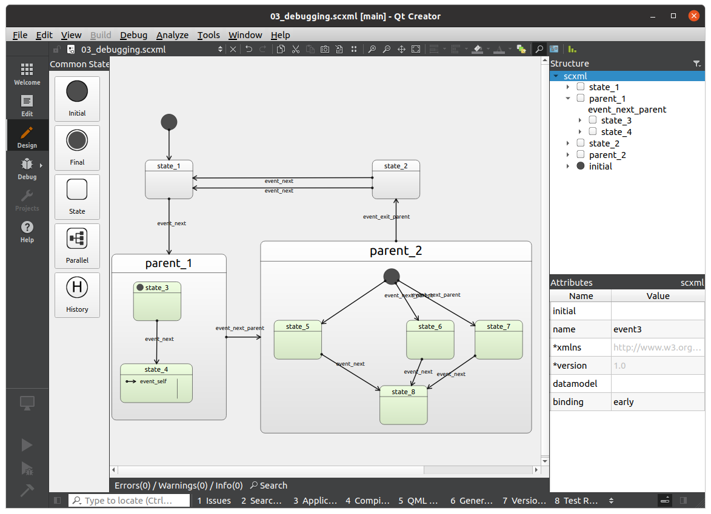
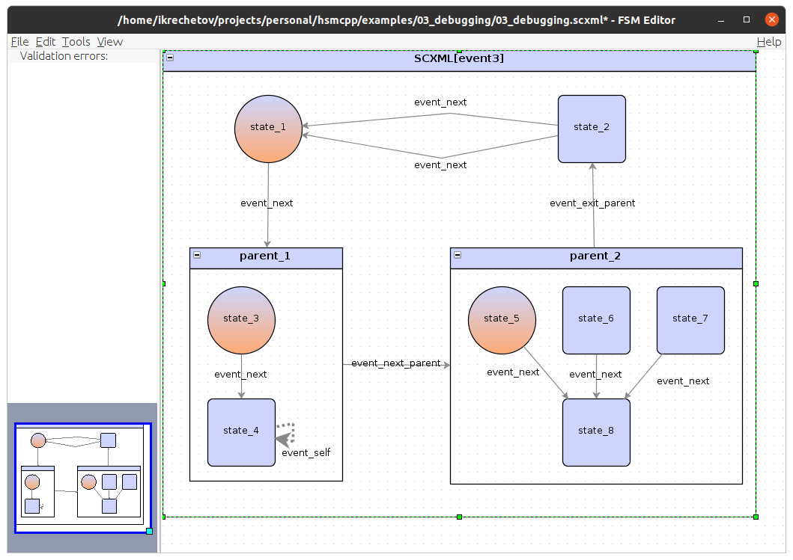
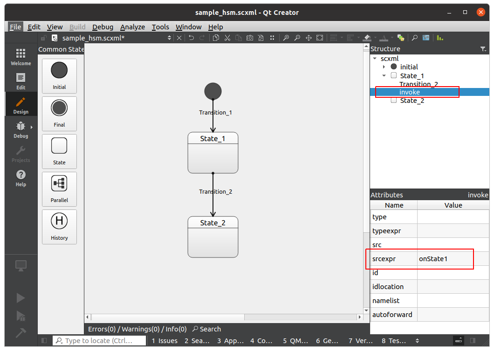
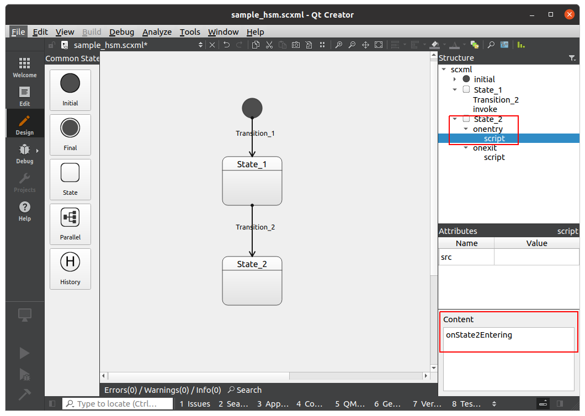
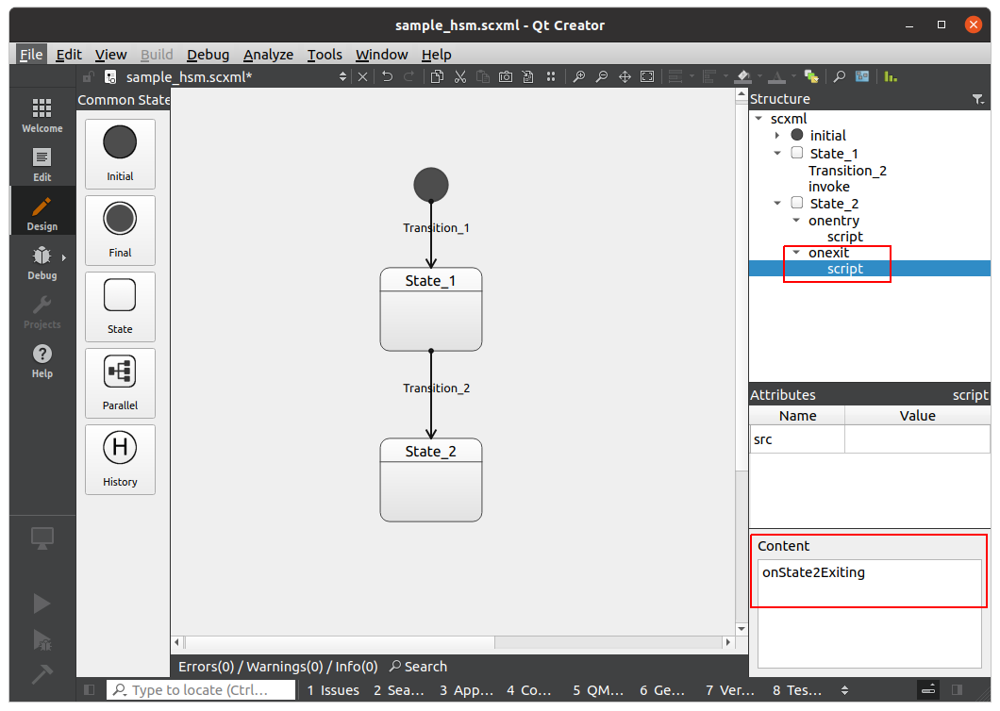
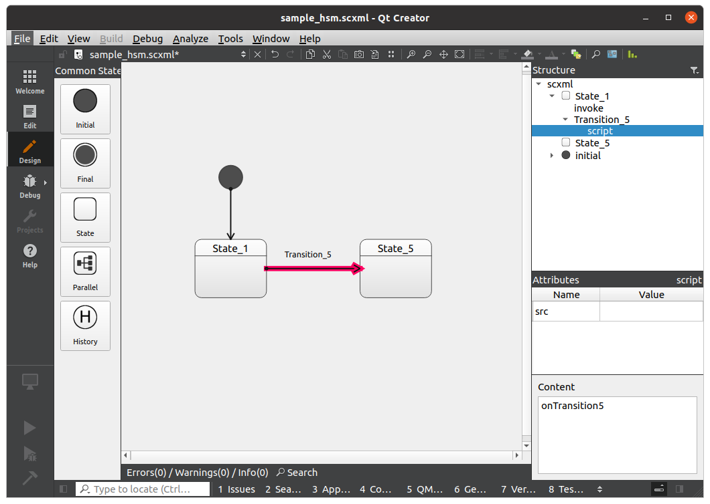
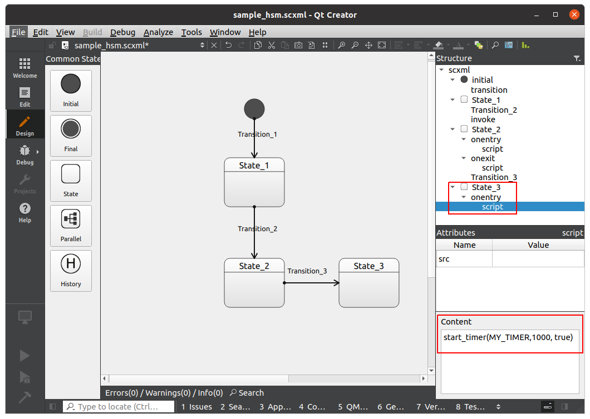
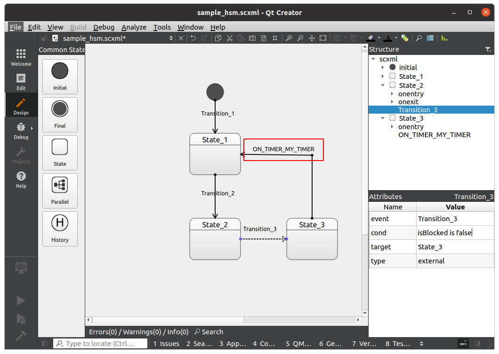
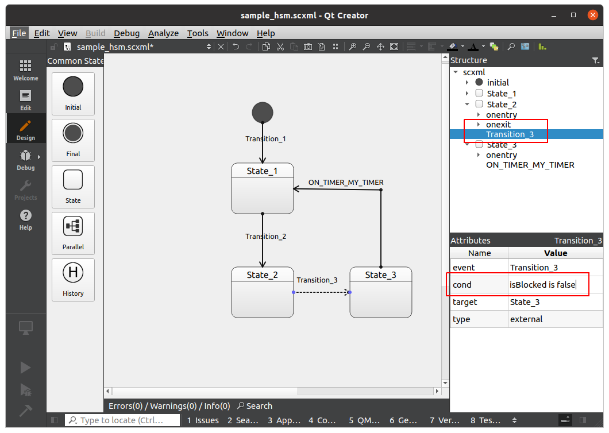
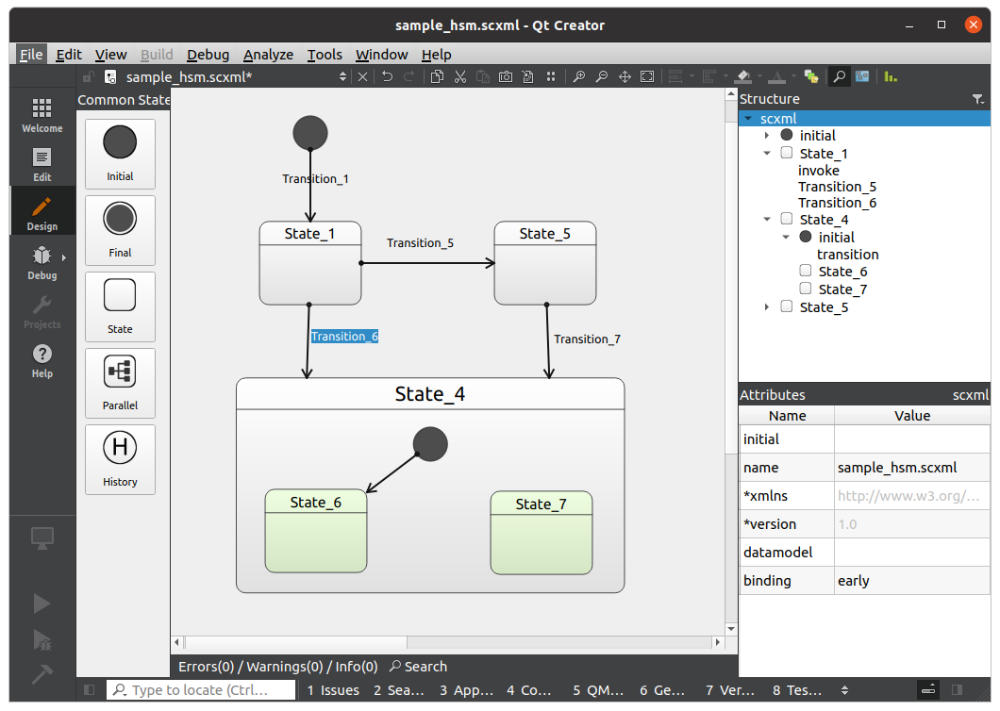
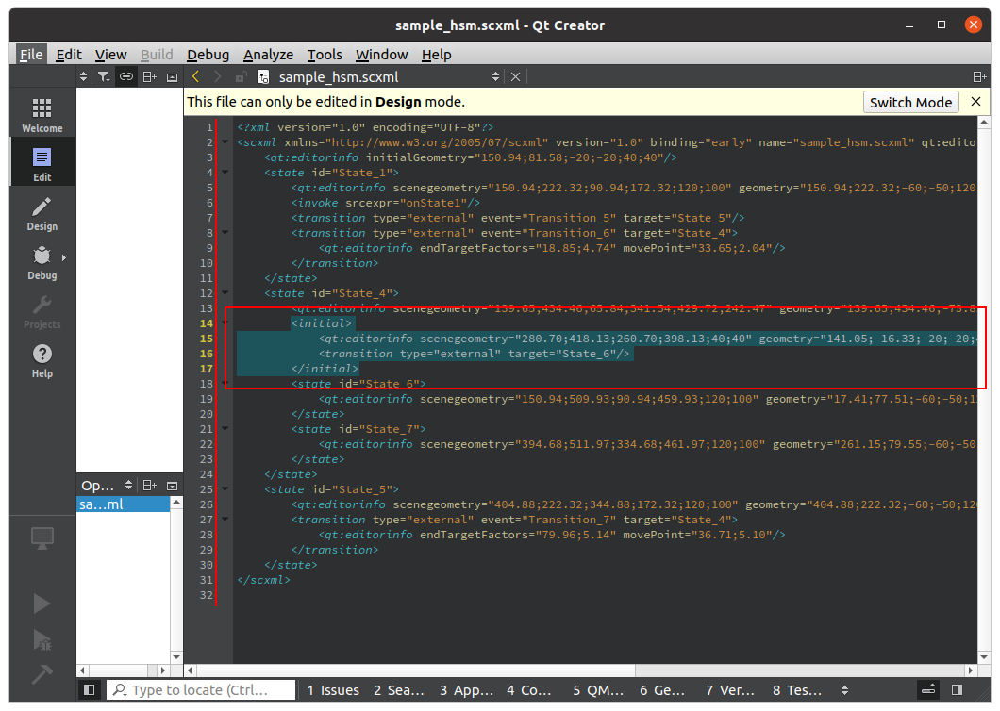

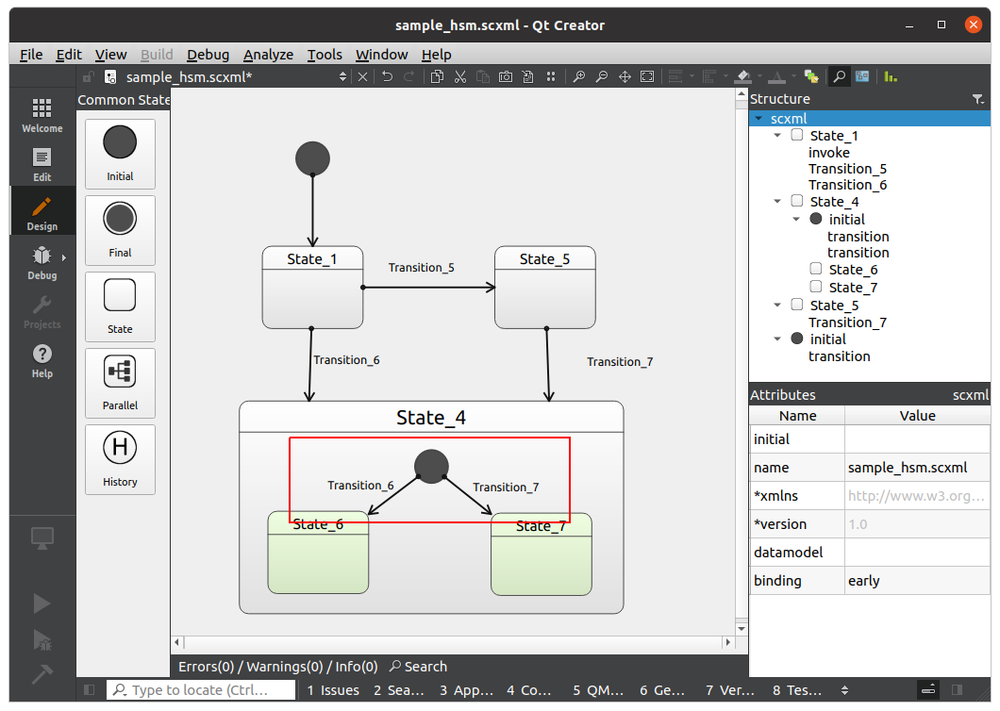