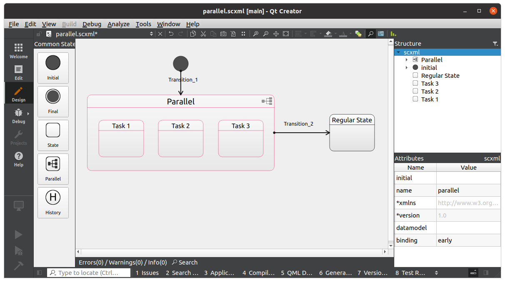

.. _features-parallel:

##################################
Parallel States
##################################

Up until now our state machines were handling a single state at a time
and no more than one state could have been active at any given moment.
That's easy to define and handle, but imagine that we are using HSM to
define behavior of a system UI and have the following requirements:

-  embedded system with two displays;
-  each display can display any of the available UI applications (Media,
   Weather, Navigation);

Since any two of the 3 defined UI applications could be active at any
given time we would need to create 3 separate HSMs to handle their logic
separately. Sounds a bit inconvenient, but still ok at this point.

.. uml:: ./parallel_usecase_simple.pu
   :align: center
   :alt: Ungrouped HSM states

But what if eventually our requirements get extended and now we also
need to add interaction between these apps? For example, ability to open
weather forecast from Navigation. At this point, things will start
getting messy since we will have to manually synchronize 2 separate HSM
in code.

All of this could be avoided by using the parallel states feature.
Essentially it allows HSM to have multiple active states and process
their transitions in parallel.

.. uml:: ./parallel_usecase_grouped.pu
   :align: center
   :alt: Sample parallel states

This structure can be achieved by simply defining multiple transitions
which will be valid at the same time:

-  non-conditional transitions with the same event;
-  conditional transitions with the same event (condition must be TRUE
   for both transitions)

.. literalinclude:: parallel_api.cpp
   :language: c++

When defining HSM in SCXML format you can also use
`parallel <https://www.w3.org/TR/scxml/#parallel>`__ tag. This approach is a bit
more restrictive and was added mostly for compatibility with SCXML
format specification. Here is an example from Qt Creator:

.. note:: It's important to understand that all transitions and callbacks are executed on a single thread.
          If you need actual parallel execution of multiple state machines then you would need to create
          multiple event dispatchers and handle such machines separately.
