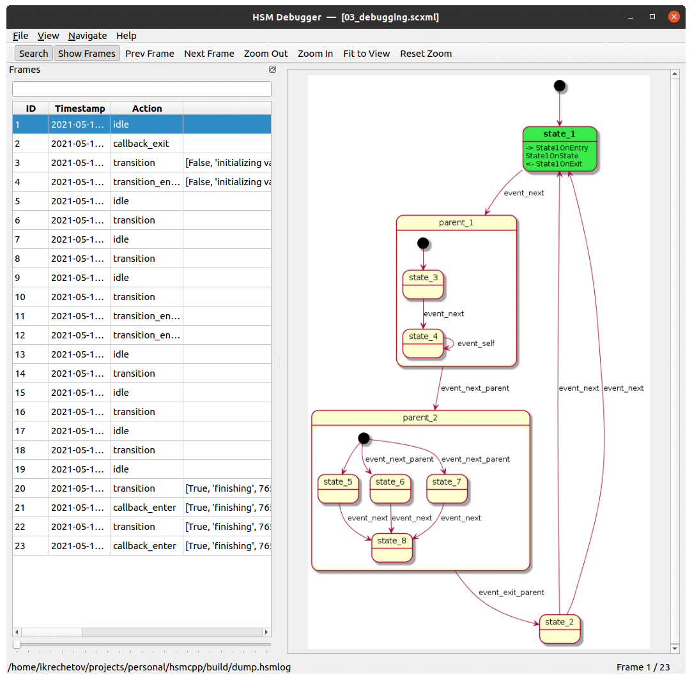
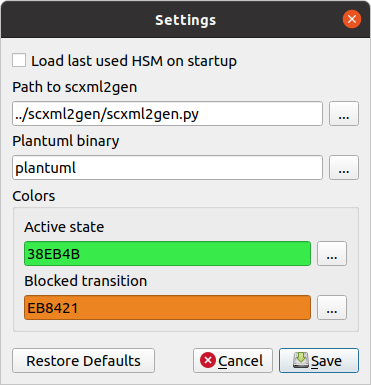
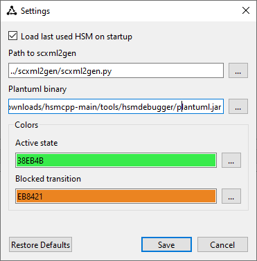
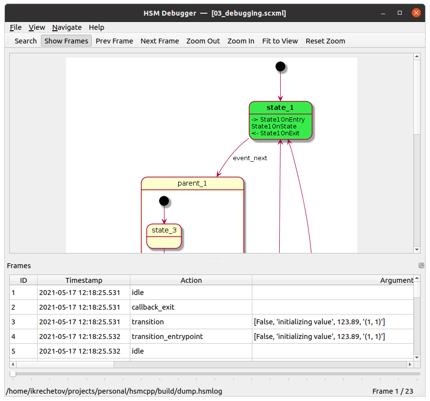
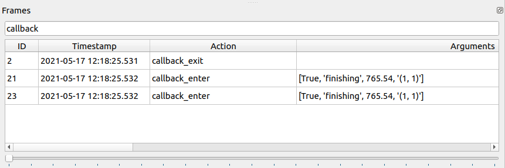
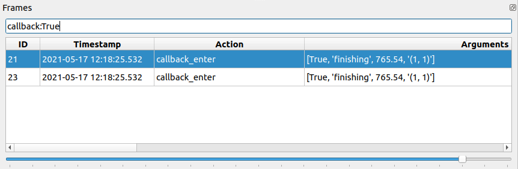

.. _tools-hsmdebugger:

######################
HSM Debugger
######################

.. contents::
   :local:

Overview
========

Hsmdebugger provides a visual way to check how HSM was executed and
identify potential issues with it. To operate it requires HSM defined in
scxml format and log file generated by your application.

Dependencies
============

-  Python 3
-  PyYaml
-  PySide6
-  plantuml

Installing dependencies (Ubuntu)
--------------------------------

.. code-block::  bash

   apt install python3
   apt install plantuml
   pip3 install PySide6
   pip3 install PyYaml

.. note:: Currently (2021.06) plantuml package on Ubuntu is tool old (V1.2018.13).
          Hopefully, this will be fixed one day, but for now you'll need to \ `download plantuml <https://plantuml.com/en/download>`__ manually.

          You can either:

          - replace instaled binary with the new version (/usr/share/plantuml/plantuml.jar);
          - or specify path to your downloaded jar file in hsmdebugger settings.

Installing dependencies (Windows)
---------------------------------

-  `Download Python <https://www.python.org/downloads/windows/>`__
-  `Dowload PlantUML <https://plantuml.com/en/download>`__

.. code-block::  bash

   pip install PySide6
   pip install PyYaml

How to use
==========

Configuring environment
-----------------------

Before starting to use hsmdebugger please check that it's environment is
correctly configured.

Go to File -> Settings:

Make sure that path to scxml2gen.py is correctly specified. Normally you
don't need to change anything if you run hsmdebugger from it's original
folder.

**For Windows:** it's necessary to specify **full path** to plantuml
binary.

Enable debugging in your application
------------------------------------

Make sure that HSMBUILD_DEBUGGING build option is set to ON.

Call enableHsmDebugging() API to start recording HSM activity into a log
file.

.. code-block::  c++

   // By default log will be written to ./dump.hsmlog file.
   // This location can be overwritten by setting ENV_DUMPPATH environment variable with desired path.
   enableHsmDebugging()

   // Path has to be provided as an argument; no default path is used.
   enableHsmDebugging(const std::string& dumpPath)

Log generation can be disabled at any time using:

.. code-block::  c++

   disableHsmDebugging()

There is no limitation on how often you can enable/disable logging.

Loading log in hsmdebugger
--------------------------

After you have generated log file from your application you can load it
in hsmdebugger to analyze:

-  load scxml file describing your HSM (File -> Open HSM)
-  load log file (File -> Open Log)

Navigating the log
------------------

There are a couple of options available to navigate the log file:

-  manually selecting the log frame in the list;
-  going to a specific frame by index (Navigate -> Go to Frame; Ctrl + G)
-  search for frame (Navigate -> Search; Ctrl + F)

   -  search supports regular expressions (Python format);
   -  example of searching by action type: **callback**

-  example of searching by action type + arguments: **callback:True**

